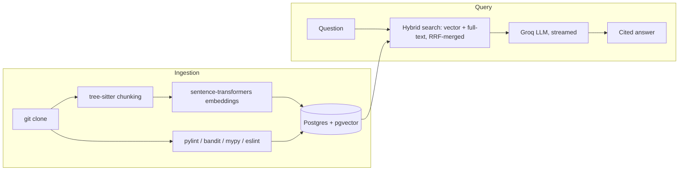

# RepoMind

RepoMind is a code-understanding assistant: point it at a GitHub repo and it answers questions about the codebase, with every claim backed by a citation into the exact lines it drew on. It also diagnoses pasted error tracebacks by grounding the explanation in retrieved code *and* static-analysis findings, rather than freelancing a root cause.

It's built around one core bet: **retrieval quality determines answer quality**, so the project treats retrieval as something to measure, not assume. An eval harness compares AST-aware chunking against naive fixed-size chunking on real recall@k numbers (see [Evaluation](#evaluation)) instead of just shipping whichever felt reasonable.

## Why this exists

Most "chat with your codebase" tools split files by character count and call it a day. RepoMind chunks code along its actual syntax tree (via tree-sitter), so a retrieved chunk is always a whole function, method, or class — never a fragment cut off mid-body. It then retrieves with a hybrid of vector similarity and full-text search (reciprocal rank fusion), so both semantic questions ("how does auth work here?") and literal ones ("what does `adapters.py` do?") resolve well. The LLM is only ever allowed to answer from what retrieval actually returned, and is instructed to say so explicitly when the context doesn't contain the answer.

## Features

- **AST-aware chunking** — tree-sitter parses each file and chunks by function/class/method boundary, across Python, JS, TS, TSX, Go, Java, Ruby, Rust, C, and C++.
- **Hybrid retrieval** — pgvector cosine similarity + Postgres full-text search, merged via reciprocal rank fusion, so filename/symbol-name matches and semantic matches both surface.
- **Citation-grounded, streaming answers** — every factual claim is followed by a `file_path:start_line-end_line` citation; answers stream token-by-token over SSE and the frontend renders each citation as a clickable jump to the exact source lines.
- **Honesty by construction** — the system prompt requires the model to say "the retrieved context doesn't cover this" rather than invent files, functions, or behavior.
- **Error diagnosis grounded in static analysis** — paste a traceback and RepoMind retrieves relevant code *and* joins in findings from pylint, bandit, mypy, and ESLint on those same files, so the LLM's explanation is checked against actual tool output, not just its own reasoning.
- **Incremental ingestion** — files are only re-chunked/re-embedded when their content hash changes (or the embedding model itself changes), so re-ingesting a repo after a small edit doesn't redo the whole pipeline.
- **Project & file summaries** — a per-file summary (from symbols + docstrings) rolls up into a project-level overview built from the README, entry points, and file summaries.

## Evaluation

`backend/app/eval/run_eval.py` runs the same 25 hand-written "where is X implemented" questions against [Flask](https://github.com/pallets/flask) using two chunking strategies, and reports recall@k (did the correct symbol appear in the top-k retrieved chunks):

| k | AST-aware chunking | Naive fixed-size chunking |
|---|---|---|
| 1 | **16%** | 0% |
| 3 | **48%** | 28% |
| 5 | **60%** | 40% |
| 10 | **68%** | 56% |

AST chunking wins at every k, most sharply at k=1 and k=3 — where it matters most, since those are the chunks that actually make it into the LLM's context window. Full per-question results are in `backend/app/eval/results.json`.

## Architecture



**Backend:** FastAPI + asyncpg, Postgres with the `pgvector` extension, `sentence-transformers` (`all-MiniLM-L6-v2`) for embeddings, `tree-sitter` for AST chunking, Groq (`openai/gpt-oss-120b`) for generation, streamed as Server-Sent Events.

**Frontend:** React + TypeScript + Vite, consuming the SSE chat/diagnose streams and rendering citations as clickable links into the source.

## Getting started

**Prerequisites:** Docker, Python 3.11+, Node 18+, a [Groq API key](https://console.groq.com).

```bash
# 1. Start Postgres (with pgvector)
docker compose up -d

# 2. Backend
cd backend
python -m venv .venv && .venv\Scripts\activate   # or `source .venv/bin/activate` on macOS/Linux
pip install -r requirements.txt
cp .env.example .env   # fill in GROQ_API_KEY
uvicorn app.main:app --reload

# 3. Frontend
cd frontend
npm install
cp .env.example .env
npm run dev
```

Then open the frontend, submit a GitHub repo URL to ingest, and once its status is `ready`, ask it questions.

## API

| Endpoint | Description |
|---|---|
| `POST /api/repos` | Kick off ingestion of a repo URL (clone, chunk, embed, static analysis — runs in the background) |
| `GET /api/repos/{id}` | Poll ingestion status (`pending` → `ingesting` → `ready`/`error`) |
| `POST /api/repos/{id}/chat` | Ask a question; streams `citations`, then `token` events, then `done` |
| `POST /api/repos/{id}/diagnose` | Paste an error; streams `citations`, `findings` (linked static-analysis results), then `token` events |
| `GET /api/repos/{id}/summary` | Project-level and per-file summaries |
| `GET /api/repos/{id}/chunk` | Fetch the raw source for a specific cited chunk |

## Testing

```bash
cd backend
pytest
```

Covers chunking (per language), retrieval (including a real pgvector integration test), LLM prompt construction, static analysis parsing, and the API routes.

## Limitations

- Retrieval is per-repo, single-turn — there's no conversation memory across questions yet.
- Static analysis findings are only linked to files that also appear in the retrieved chunks, not run repo-wide against the question.
- Groq's on-demand tier has a modest tokens-per-minute limit, so context sent to the LLM is capped and truncated to fit — very large single functions get abbreviated rather than shown in full.
